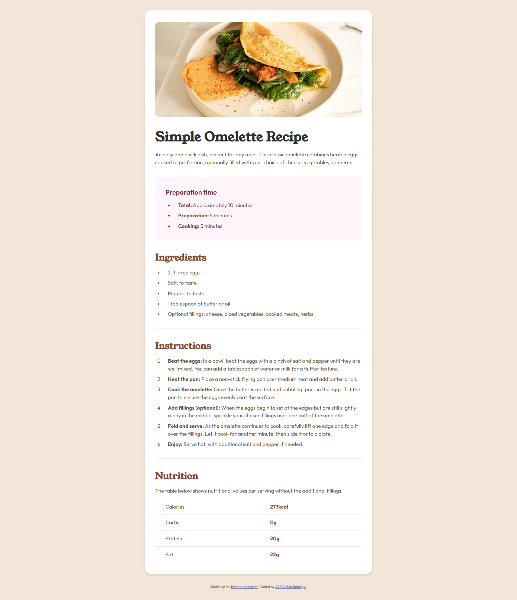
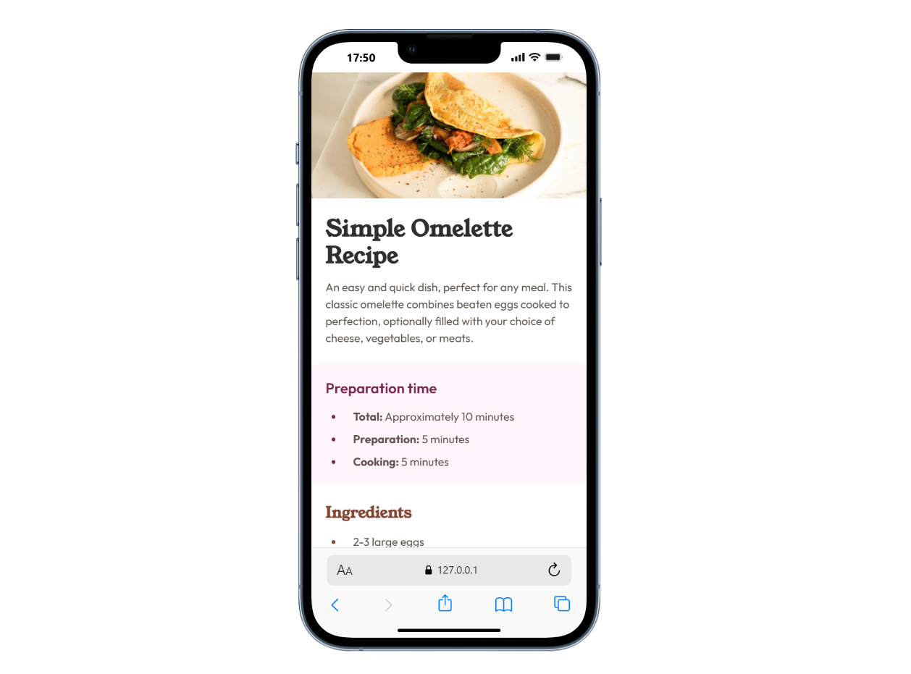

# Frontend Mentor - Recipe page solution

This is a solution to the [Recipe page challenge on Frontend Mentor](https://www.frontendmentor.io/challenges/recipe-page-KiTsR8QQKm). Frontend Mentor challenges help you improve your coding skills by building realistic projects. 

## Table of contents

- [Overview](#overview)
  - [The challenge](#the-challenge)
  - [Screenshot](#screenshot)
  - [Links](#links)
- [My process](#my-process)
  - [Built with](#built-with)
  - [What I learned](#what-i-learned)
  - [Continued development](#continued-development)
  - [Useful resources](#useful-resources)
- [Author](#author)
- [Acknowledgments](#acknowledgments)

This document describes the approach, decisions, and learnings from building the Recipe page.

## Overview

### The challenge

Users should be able to:

- View the optimal layout depending on their device's screen size
- See hover and focus states for interactive elements
- Read structured content with proper semantics (headings, lists, table)

### Screenshot

Desktop


Mobile


### Links


- Solution URL: [Recipe page solution](https://github.com/ichane31/Recipe-page)
- Live Site URL: [Recipe page](https://recipe-page-ecru-beta.vercel.app/)

## My process

### Built with

- Semantic HTML5 markup (use of `section`, `footer`, `h1`–`h2`, lists, table semantics)
- CSS custom properties (color tokens)
- Flexbox
- Mobile-first responsive workflow with media queries (900px, 600px)
- Local custom fonts via `@font-face`

### What I learned

- Structured tables with row headers improve accessibility for screen readers:

```html
<table>
  <tr>
    <th scope="row">Calories</th>
    <td>277kcal</td>
  </tr>
</table>
```

- Defining local fonts and using CSS variables for a consistent design system:

```css
@font-face {
  font-family: 'Young-Regular';
  src: url('./assets/fonts/young-serif/YoungSerif-Regular.ttf') format('truetype');
}

:root {
  --stone-100: hsl(30, 54%, 90%);
  --brown-800: hsl(14, 45%, 36%);
}
```

- Building a clean mobile layout with media queries and full-bleed hero image:

```css
@media (max-width: 600px) {
  body { padding: 0; background: #fff; }
  .recipe-container { border-radius: 0; box-shadow: none; }
  .recipe-container > img { border-radius: 0; }
}
```

### Continued development

- Explore `@media (prefers-reduced-motion: reduce)` to enhance accessibility
- Add print styles for cleaner recipe printing
- Experiment with CSS `container queries` for more granular responsiveness

### Useful resources

- MDN: Media queries – https://developer.mozilla.org/en-US/docs/Web/CSS/Media_Queries/Using_media_queries
- WAI Tutorials: Tables – https://www.w3.org/WAI/tutorials/tables/
- MDN: `:focus-visible` – https://developer.mozilla.org/en-US/docs/Web/CSS/:focus-visible

## Author

- ASSOUMA Roukéya
- Frontend Mentor : [@ichane31](https://www.frontendmentor.io/profile/ichane31)

## Acknowledgments

Thanks to Frontend Mentor for the design and challenge brief.
